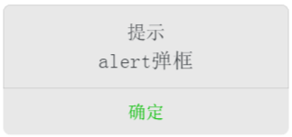
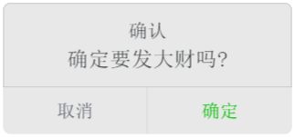
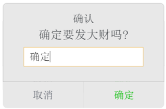

## vue-alert

### Install

```bash
npm install vue-alert2 -S

yarn add vue-alert2
```

### QuickStart
```javascript
require('vue-alert2/dist/vue-alert.css');

// in ES6 modules
import {Alert,Confirm,Prompt} from 'vue-alert2';

// in CommonJS
const {Alert,Confirm,Prompt} = require('vue-alert2');

// in Global variable
const {Alert,Confirm,Prompt} = VueAlert;

Vue.use(Alert);
Vue.use(Confirm);
Vue.use(Prompt);
```
```javascript
this.$alert({
    show:true,
    title:'提示',
    content:'alert弹框',
    okText:'确定',
    onOk:function(){
        alert('ok');
    }
});
Vue.confirm({
    show:true,
    title:'确认',
    content:'确定要发大财吗?',
    okText:'确定',
    onOk:function(){
        alert('ok');
    },
    cancelText:'取消',
    onCancel:function(){
        alert('cancel');
    }
});
```

### Params

#### Alert

`props`
- `show`: whether to show alert,type is Boolean
- `title`: alert title,type is String
- `content`: alert content text,type is String
- `okText`: ok button's text, type is String
- `onOk`: ok button click handler,type is Funcion

`events`
- `onOpen`: event on alert show,type is Function
- `onClose`: event after alert close,type is Function

#### Confirm

`props`
- `show`: whether to show confirm,type is Boolean
- `title`: confirm's title,type is String
- `content`: confirm's content text,type is String
- `okText`: ok button's text,type is String
- `onOk`: ok button's click handler,type is Function
- `cancelText`: cancel button's text,type is String
- `onCancel`: cancel button's click handler,type is Function

`events`
- `onOpen`: event on confirm show,type is Function
- `onClose`: event after confirm close,type is Function

#### Prompt

`props`
- `show`: whether to show prompt,type is Boolean
- `title`: prompt's title,type is String
- `content`: prompt's content text,type is String
- `input`: the input's value in prompt
- `okText`: ok button's text,type is String
- `onOk`: ok button's click handler,type is Function
- `cancelText`: cancel button's text,type is String
- `onCancel`: cancel button's click handler,type is Function

`events`
- `onOpen`: event on confirm show,type is Function
- `onClose`: event after confirm close,type is Function

### Preview

<br/>
<br/>
